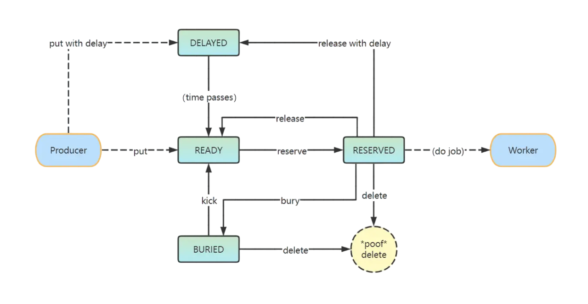

# beanstalkz
WIP


```txt

                    Typical job lifecycle

           put            reserve               delete
          -----> [READY] ---------> [RESERVED] --------> *poof*

        
                        Job lifecycle   
           
           put with delay               release with delay
          ----------------> [DELAYED] <------------.
                                |                   |
                                | (time passes)     |
                                |                   |
           put                  v     reserve       |       delete
          -----------------> [READY] ---------> [RESERVED] --------> *poof*
                               ^  ^                |  |
                               |   \  release      |  |
                               |    `-------------'   |
                               |                      |
                               | kick                 |
                               |                      |
                               |       bury           |
                            [BURIED] <---------------'
                               |
                               |  delete
                                `--------> *poof*
        

```


<br />
